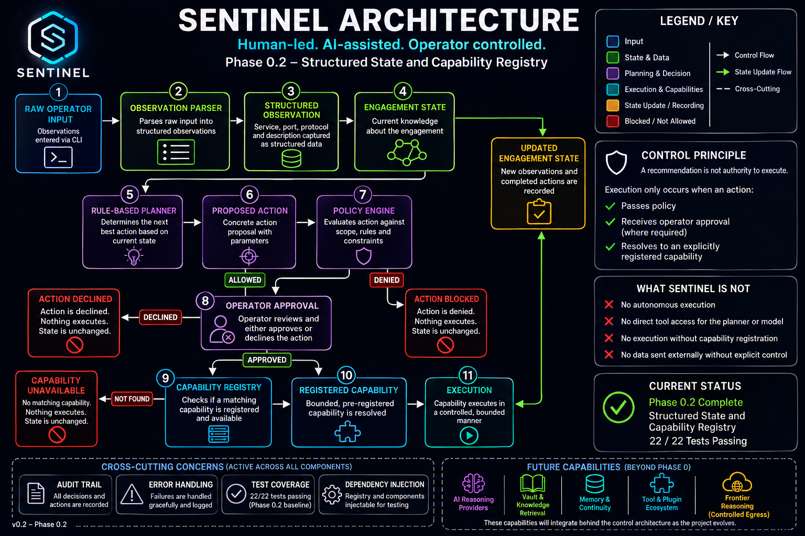

# Sentinel

**Human-led. AI-assisted. Operator controlled.**

Sentinel is the Python application being developed as part of **Project Sentinel**: an experimental cybersecurity assistant designed to support penetration testing, security research and learning without removing the human operator from the decision-making process.

Rather than building an autonomous security agent and attempting to constrain it afterwards, Sentinel starts from the opposite assumption:

> **AI may reason, recommend and assist — but authority belongs to the operator.**

The application separates reasoning from execution through explicit state, policy, operator approval and capability boundaries.

Potentially consequential actions should be inspectable, explainable and subject to operator control before they reach executable behaviour.

Sentinel is currently deliberately small. Phase 0 established the control architecture that future AI reasoning and security capabilities will operate within.

---

## Project Sentinel and Sentinel

**Project Sentinel** is the wider engineering project.

It contains the vision, requirements, architecture, Architectural Decision Records, roadmap, development history, test records and supporting knowledge that define how Sentinel should evolve.

**Sentinel** is the Python software produced by that project.

This repository contains the executable application prototype and its automated tests.

Detailed engineering documentation is maintained separately in the:

[Project Sentinel Vault](https://github.com/ItsNotMe9942/Project-Sentinel-Vault)

---

## Architecture



The diagram above represents the **completed Phase 0.2 architecture**.

It shows the successful control flow, the state-update path, the major failure paths and the boundaries that future capabilities must operate behind.

The successful control flow is:

```text
Raw Operator Input
        |
        v
Observation Parser
        |
        v
Structured Observation
        |
        v
Engagement State
        |
        v
Rule-Based Planner
        |
        v
Proposed Action
        |
        v
Policy Engine
        |
        v
Operator Approval
        |
        v
Capability Registry
        |
        v
Registered Capability
        |
        v
Execution
        |
        v
Updated Engagement State
```

The separation is deliberate:

> **A recommendation is not authority to execute.**

For an action to reach execution it must:

1. pass policy;
2. receive operator approval where required;
3. resolve to an explicitly registered capability.

Failure at any of those boundaries prevents execution.

A policy-denied action is blocked.

An operator-declined action does not execute.

An action without a matching registered capability is unavailable and does not execute.

The planner therefore proposes behaviour but does not possess execution authority.

---

## Why Sentinel?

Modern AI systems can generate commands, analyse output and propose attack paths remarkably well.

Capability alone is not enough for a system operating around security tooling.

A useful cybersecurity assistant also needs to answer harder questions:

- What is it actually allowed to do?
- What information may leave the local environment?
- Which actions require explicit operator approval?
- What does the system know, and where did that knowledge come from?
- How should uncertainty be represented?
- Which capabilities are actually available for execution?
- How do we prevent persuasive model output from becoming authority?
- How do we preserve the operator's opportunity to think, learn and disagree?

Sentinel treats those questions as architectural concerns rather than features to bolt on afterwards.

Over time, Sentinel should also reduce the cognitive overhead surrounding technical work by helping maintain engagement context, surface relevant knowledge and methodology, organise evidence and support documentation.

---

## Current Status

**Phase 0 — Agent Runtime Prototype is complete at prototype level.**

### Phase 0.1 — Minimal Control Loop

Phase 0.1 established the first complete deterministic control path:

- engagement state;
- proposed actions;
- deterministic planning;
- policy evaluation;
- explicit operator approval;
- simulated execution;
- completed-action recording;
- automated regression testing.

### Phase 0.2 — Structured State and Capability Registry

Phase 0.2 strengthened that foundation by introducing:

- structured engagement observations;
- a dedicated raw-input parsing boundary;
- structured service, port and protocol metadata;
- preservation of free-form observations without inventing structure;
- deterministic planning over structured engagement state;
- independent policy evaluation;
- explicit operator approval;
- explicitly registered bounded capabilities;
- separation of capability-specific behaviour from the Agent Runtime;
- refusal to execute unavailable capabilities;
- recording of completed actions only after capability resolution and execution;
- dependency injection of the capability registry for isolated testing;
- operation of the Agent Runtime independently of any reasoning model.

The complete automated regression suite currently passes:

> **22/22 tests**

The primary execution paths have also been verified manually through the command-line interface.

The Phase 0 completion review found no blocking architectural issues.

Sentinel is therefore ready to proceed into the **Foundation Release**.

---

## Structured Observations

Earlier versions of Sentinel represented observations as raw strings.

Phase 0.2 introduced a structured `Observation` model.

For example:

```python
Observation(
    description="80/tcp open http",
    service="http",
    port=80,
    protocol="tcp",
)
```

Raw operator input is processed by `observation_parser.py` before entering engagement state.

The planner can therefore reason over explicit fields such as service, port and protocol rather than searching arbitrary human-readable text for keywords.

Unknown but non-empty observations are preserved as description-only observations rather than being discarded or incorrectly classified.

This establishes a clear boundary between raw input, interpretation, stored knowledge and planning.

---

## Capability Registry

Phase 0.2 introduced an explicit boundary between approved actions and executable behaviour.

A `Capability` gives executable behaviour a stable name, description and callable handler.

The `CapabilityRegistry` controls which capabilities are deliberately available to Sentinel.

The current prototype registers two bounded simulated capabilities:

- `enumerate_http`
- `review_observations`

If an action passes policy and receives operator approval but no matching capability is registered, Sentinel refuses to execute it.

The action is not recorded as completed.

This means that neither the current deterministic planner nor a future AI reasoning model gains execution authority merely by proposing the name of an action.

---

## Repository Structure

```text
Sentinel/
├── actions.py
├── capabilities.py
├── capability_registry.py
├── main.py
├── observation_parser.py
├── planner.py
├── policy.py
├── runtime.py
├── state.py
├── docs/
│   └── images/
│       └── sentinel-architecture.png
└── tests/
```

The responsibilities are intentionally separated:

- **State** records what Sentinel currently knows.
- **Observation Parser** converts raw input into structured observations.
- **Planner** proposes what should happen next.
- **Policy Engine** determines whether an action may proceed.
- **Operator Approval** preserves human authority.
- **Capability Registry** determines whether approved behaviour is available.
- **Capabilities** contain bounded executable behaviour.
- **Agent Runtime** coordinates the control loop.

---

## Running Sentinel

Activate the project's Python virtual environment and run:

```bash
python3 main.py
```

Example:

```text
Project Sentinel — Phase 0.2: Structured State and Capability Registry
Target: 10.10.10.10

Paste one observation.
Example: 80/tcp open http
> 80/tcp open http
```

For an HTTP observation, the current deterministic planner can propose `enumerate_http`.

Policy evaluates the proposed action and requires operator approval before the registered simulated capability can execute.

A successful approved path currently resembles:

```text
--- Sentinel Decision ---
Target: 10.10.10.10
Phase: enumeration
Action: enumerate_http
Reason: An HTTP service has been observed and has not yet been enumerated.
Policy: require_approval
Policy reason: Operator approval is required before simulated execution.
Approve this action? [y/N]: y
[SIMULATED] Enumerating HTTP for target: 10.10.10.10
Action recorded.
```

---

## Testing

Run the complete regression suite with:

```bash
python3 -m unittest discover -s tests -v
```

Current verified baseline:

```text
Ran 22 tests

OK
```

> **Phase 0 regression baseline: 22/22 tests passing.**

Automated coverage currently verifies behaviour across:

- capability registration;
- capability resolution;
- duplicate capability rejection;
- unavailable capability rejection;
- registered handler execution;
- structured engagement state;
- observation parsing;
- structured service metadata;
- preservation of free-form observations;
- empty-observation rejection;
- planner behaviour;
- prevention of repeated HTTP enumeration;
- planner fallback behaviour;
- policy scope enforcement;
- operator approval requirements;
- approved runtime execution;
- operator-declined actions;
- policy-denied actions;
- completed-action recording;
- CLI integration.

The approval, decline, policy-denial and registered-capability execution paths have also been exercised manually.

---

## What Sentinel Does Not Do Yet

Phase 0 deliberately proved the control architecture before introducing significant intelligence or offensive capability.

The current prototype does **not yet** provide:

- model-driven reasoning;
- real security-tool execution;
- dynamic plugin discovery;
- persistent long-term engagement memory;
- vault retrieval;
- Frontier reasoning;
- autonomous offensive execution.

It also does not give the current planner or a future reasoning model direct access to security tools.

These are deliberately deferred capabilities rather than incomplete Phase 0 requirements.

They will be introduced incrementally behind the control boundaries established during Phase 0.

---

## Beyond Phase 0

The completed Phase 0 control architecture is intended to support future capabilities without transferring ownership of policy, state or execution to those capabilities.

Planned areas include:

- AI reasoning providers;
- vault and knowledge retrieval;
- memory and continuity;
- tool and plugin integration;
- Frontier reasoning with controlled egress.

The accepted Project Sentinel architecture defines three logical reasoning tiers:

- **Local Fast**
- **Local Reasoning**
- **Frontier** — optional and explicitly controlled.

These reasoning providers are intended to sit behind stable interfaces rather than owning state, policy or execution.

The Phase 0 principle remains:

> **Sentinel controls state, policy and execution independently of whichever reasoning model is attached.**

---

## Development Approach

Sentinel is developed through small, understandable and testable increments:

```text
Design
  |
  v
Document
  |
  v
Implement
  |
  v
Test
  |
  v
Review
  |
  v
Grow
```

The objective is not to maximise capability as quickly as possible.

The objective is to ensure that Sentinel remains understandable, testable and operator-controlled as its capabilities grow.

---

## What's Next?

With Phase 0 complete, development can proceed into the **Foundation Release**.

The Foundation Release will begin introducing real intelligence around the proven runtime rather than replacing its control architecture.

Planned areas include:

- the first real reasoning-model provider;
- vault and knowledge retrieval;
- context management;
- persistent continuity;
- further evolution of structured engagement state.

These capabilities will be introduced behind the boundaries already established during Phase 0.

The fundamental constraint remains unchanged:

> **Models may reason and propose. Sentinel controls whether anything happens.**

---

## Project Documentation

Detailed architectural reasoning, requirements, ADRs, roadmap material, development history and test records are maintained in the:

[Project Sentinel Vault](https://github.com/ItsNotMe9942/Project-Sentinel-Vault)

This keeps the Sentinel repository focused on executable software while preserving the reasoning and engineering history behind it.

---

## Project Status

**Project Sentinel:** Active development
**Sentinel application:** Phase 0 complete at prototype level
**Phase 0.2:** Verified complete
**Automated regression baseline:** 22/22 tests passing
**Phase 0 completion review:** Passed
**Next major milestone:** Foundation Release

---

Sentinel is deliberately small today.

The architecture has been established first so that future capability can be added **within known boundaries rather than becoming the boundary itself**.
